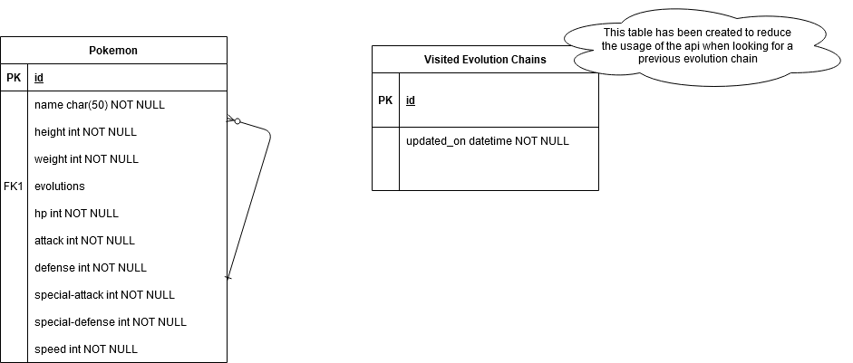
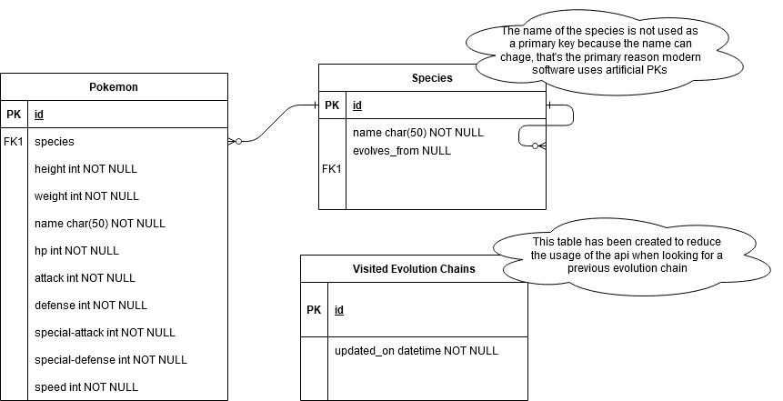

# Oscar Chamat | mopokemon project

This repository contains my Test Project with the [pokeapi](https://pokeapi.co/), thank you for taking the time to read this documentation.
If you want me to implement some new feature, fix something or give any further detail don't hesitate on reaching me at chamatoscar@gmail.com.

## Installation
Assuming you have the repository cloned already

### Requirements
This is what you need to install in your computer

* `Docker` https://docs.docker.com/install
  — Install Docker for different operating system. See documentation.
* `Docker Compose` https://docs.docker.com/compose/install/
  — Install Docker Compose for macOS, Windows, and Linux
* `cURL` https://develop.zendesk.com/hc/en-us/articles/360001068567-Installing-and-using-cURL#install
  — Install curl

### Testing the command
1) To run the rest service just do -> `docker-compose run rest-service bash`

#### Running command
1) Once inside the console of the container you can run the command -> `./manage.py save_evolution_chain_data --force --traceback 1`
2) In general the command can be run with -> `./manage.py save_evolution_chain_data CHAIN_ID`
    - Where CHAIN_ID is an integer that identifies an evolution chain.
3) If you want to see the manual of the command use -> `./manage.py save_evolution_chain_data`

### Testing the api-rest
1) To run the rest service just do -> `docker-compose up`

#### Testing the api rest
* The database is added to the code (db.sqlite3) for fast testing, the command has been run with CHAIN_ID=1 and CHAIN_ID=2 so charmander/bulbasaur and their evolutions have been added.
1) Make sure you have curl installed in the host machine and then -> `curl http://localhost:8000/api/v1/pokemon/ivysaur`

2) If you want to test in a more visual manner here is the url to the project in postman -> https://documenter.getpostman.com/view/7547562/TW6tMAnE
    - You can also see some examples of the urls.
## Implementation
I implemented the test project as a Django application and using Django Rest Framework for the API Rest.

### Implemented Features
* Docker machine with a up to date installation.
* Docker compose to make easier the user of Docker.
* Design of the Database for eficiency and simple access to data.
* Django command with extra possible arguments in the case of something failing.
* Used ViewSets (Equivalent to Class Based Views) for the API View.
* Details; documentation, private variables and methods, custom error messages and providing tool to reduce the complexity of testing.

## Design

### Entity Relationship diagram
* There has been 2 versions of the ER Diagram, thanks to the depper understanding of the problem
* To modify; https://drive.google.com/file/d/1yZk9WSLOnIvv9rz-lJvltbGkvMn_fL-7/view?usp=sharing

#### V1

#### V2

## Extra notes
* Different notes of design provided in the file [minor-notes.md](minor-notes.md)

## Closing
Thanks for reading this far, I wish you a good day and I'm very looking forward to an interview with you.